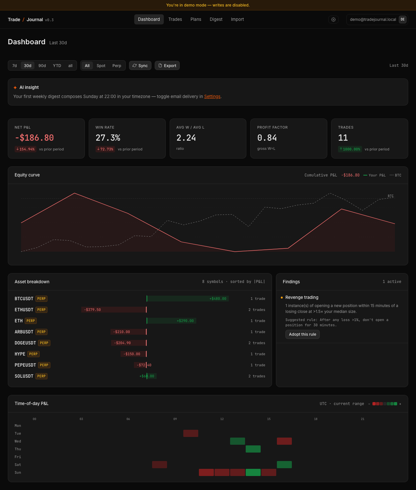
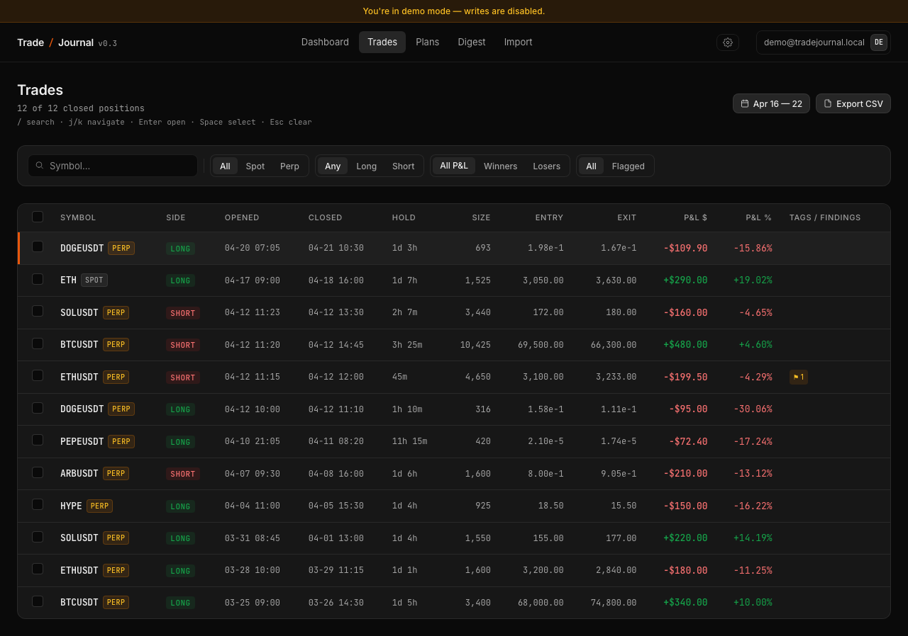
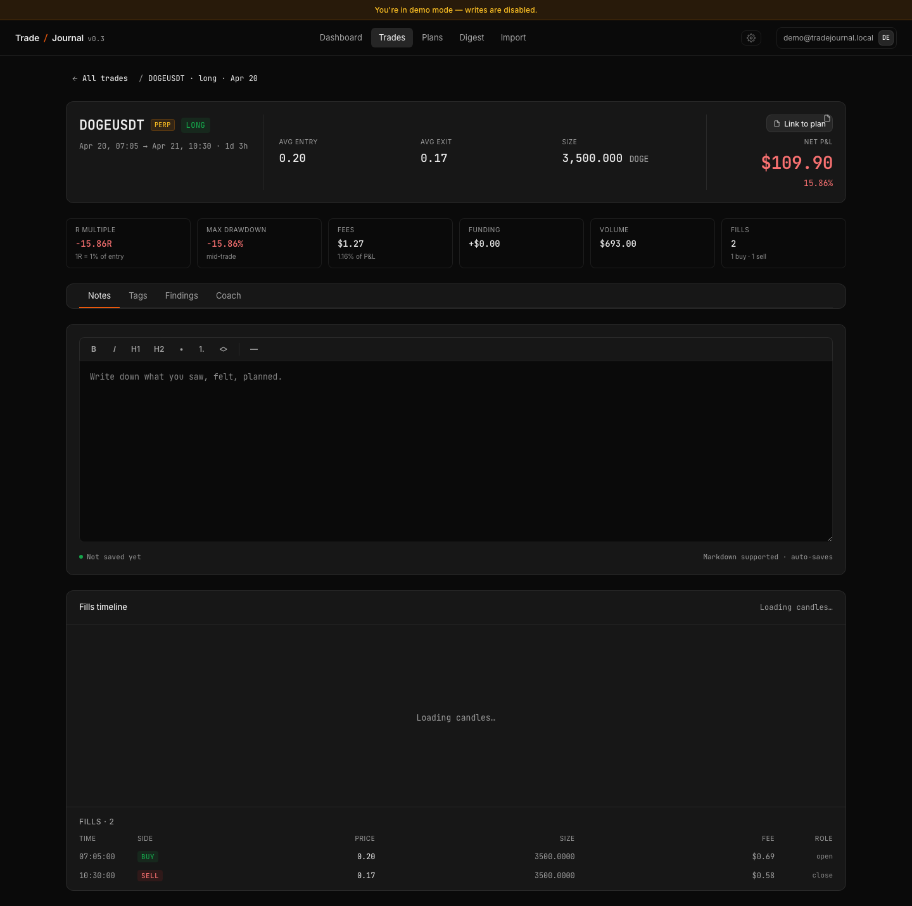
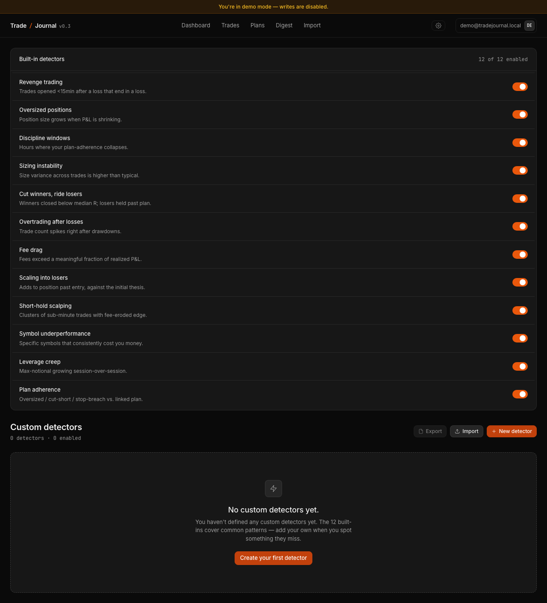

<div align="center">

# Trade Journal

### A trading journal that talks back.

Import your Binance, Hyperliquid, Bybit, or OKX trades. We merge fills into positions, run 12 built-in behavioral detectors over your history (plus any you write yourself), and surface the patterns you'd miss. Direct, honest, no fluff.

[](https://tanstack.com/start)
[](https://react.dev)
[](https://orm.drizzle.team)
[](https://neon.tech)
[](https://www.anthropic.com)
[](https://www.inngest.com)
[](#status)

</div>

---



## What's inside

|   |   |
|---|---|
| **Multi-exchange ingestion** | CSV imports for Binance Spot/Futures, Bybit Spot/Perp, OKX, Hyperliquid. Plus Hyperliquid wallet-address pull (no keys, no signatures). Adapters merge fills into positions deterministically. |
| **12 built-in pattern detectors** | Revenge trading. Oversized positions. Discipline windows. Sizing instability. Cut winners / ride losers. Overtrading after losses. Fee drag. Scaling into losers. Short-hold scalping. Symbol underperformance. Leverage creep. Plan adherence. Each finding links to the trades that triggered it. |
| **Custom detectors** | Compose your own predicates over position fields with a nested AND/OR/NOT editor. Saves as JSON, runs every derivation, surfaces alongside built-ins. Export and import as JSON to share or version. |
| **AI Coach** | Per-trade narrative and grade letter (A–F), composed by Claude Sonnet 4.6, rendered above the fold. Cached by `(positionId, derivationVersion)` so it costs one LLM call per trade ever. |
| **AI Weekly Digest** | Sunday 22:00 in your timezone. Greeting, biggest win, biggest loss, top finding, one thing to try, one rule to adopt. Sent by email or previewed in-app. |
| **Plans + adherence** | Pre-write entry/stop/target/rationale. Auto-link new trades to matching plans. The plan-adherence detector reports which trades hit, missed, or violated their plan. |

---

## See it

<table>
<tr>
<td width="50%"></td>
<td width="50%"></td>
</tr>
<tr>
<td><b>/trades</b> — flagged trades show a finding chip; sortable, filterable, keyboard-driven (<code>j/k/Enter</code>).</td>
<td><b>/trades/$id</b> — KPI tiles, AI Coach card, fills timeline with candles, notes, tags, findings, plan link.</td>
</tr>
<tr>
<td></td>
<td></td>
</tr>
<tr>
<td><b>/detectors</b> — toggle built-ins, write custom predicates, export to JSON.</td>
<td><b>/dashboard</b> — KPIs, equity curve with BTC overlay, time-of-day heatmap, findings sidebar, weekly AI insight.</td>
</tr>
</table>

---

## Quick start

```bash
git clone https://github.com/NikolaCehic/trading_journal.git
cd trading_journal
pnpm install
cp .env.example .env.local        # fill in DATABASE_URL + BETTER_AUTH_SECRET + GOOGLE_CLIENT_ID/SECRET
pnpm db:migrate                   # or: pnpm drizzle-kit push
pnpm dev                          # app on http://localhost:3000
```

For the AI features (Coach, Digest):

```
ANTHROPIC_API_KEY=sk-ant-api03-...
AI_ENABLED=on
```

For background jobs (HL wallet pull, weekly digest cron, plan auto-match) in dev, leave the `INNGEST_*` keys empty and run a second terminal:

```bash
pnpm inngest:dev
```

The Inngest dev server discovers the app at `localhost:3000/api/inngest` automatically.

### Try the demo

Public landing has a **Try demo** button that mints a read-only demo session — no Google sign-in, no DB writes, but every UI surface is exercised against seeded data (12 positions, 1 finding, full equity curve).

### Test imports without a real exchange account

`fixtures/mock-import/` has a CSV per exchange variant (`binance-spot-mock.csv`, `bybit-perp-mock.csv`, `okx-mock.csv`, etc.) — 20 fills each, 5 symbols, 2-week spread. Drop them on `/import` to exercise the full pipeline. Detector-flavored fixtures (`loss-chaser.csv`, `revenge-trader.csv`, `size-bloater.csv`) live alongside for stress-testing specific patterns.

---

## Tech stack

| Layer | Tools |
|---|---|
| **Framework** | TanStack Start (React 19) + TanStack Router + TanStack Query |
| **Database** | Neon Postgres (HTTP for short queries, WebSocket for transactional writes) + Drizzle ORM |
| **Auth** | Better Auth (Google OAuth + signed cookies) |
| **Background jobs** | Inngest — wallet ingestion, weekly digest, plan auto-match |
| **AI** | Anthropic Claude Sonnet 4.6 (per-trade Coach + weekly Digest, with grounding-validator and deterministic fallbacks) |
| **Validation** | Zod schemas at every server-fn boundary; predicate evaluator with allowlist grounding for AI output |
| **Testing** | Vitest (unit + component) + Playwright (smoke + UX audit) |

---

## How it's organized

```
app/routes/(app)/_layout/         TanStack Start routes — dashboard, trades, plans, detectors, import, digest, settings
app/routes/(public)/              landing, changelog
app/routes/api/                   /api/inngest (function discovery + event delivery), /api/auth/*, /api/demo
src/server/                       createServerFn handlers — getDashboardBundle, getTradeList, getTradeCoach, ...
src/derivation/                   fills → positions, metrics, detectors, persist (atomic via Neon WS transaction)
src/jobs/                         Inngest functions — hl-wallet-pull, derive-on-ingestion-complete, plan-auto-match, ...
src/narrator/                     LLM client + prompts + grounding validator + budget gating + extract helpers
src/ingestion/adapters/           per-exchange CSV adapters (binance, bybit, okx, hyperliquid) + HL wallet API adapter
src/db/schema/                    Drizzle table definitions, single source of truth
src/components/                   React components — primitives, dashboard cards, trade detail, modals
docs/qa/                          per-phase QA audits + the AI surfacing + UX fix plans
docs/wiki/                        roadmap, user flows, phase log
```

---

## Status

12 phases shipped, every audit finding closed. Core product done.

| Phase | Theme | Status |
|---|---|---|
| 0–1 | Foundation + ingestion (CSV adapters + HL wallet) | Shipped |
| 2 | Derivation engine — fills → positions, metrics, detectors | Shipped |
| 3 | Dashboard, trades, journal | Shipped |
| 4 | AI Narrator (Coach + Weekly Digest) | Shipped |
| 5 | Real-data demo + empty-state polish | Shipped |
| 6 | Polish + plans foundation | Shipped |
| 7 | Plans + plan-adherence detector | Shipped |
| 8 | Volume pane, BTC overlay, plan auto-match | Shipped |
| 9–10 | Market-data caching + CI | Shipped |
| 11 | Custom detectors with nested predicate editor | Shipped |
| 12 | Polish close-out (export/import, builtin toggles) | Shipped |
| QA | UX audit, AI surfacing — 6 HIGH + 3 MED + cross-cutting patterns | Shipped |

See [`docs/wiki/phases.md`](docs/wiki/phases.md) for the per-phase changelog with commit ranges and deferred items.

---

## Built with [Claude Code](https://claude.com/claude-code)

This project was developed by Claude (Anthropic's AI coding agent) under the direction of [@NikolaCehic](https://github.com/NikolaCehic). Every phase plan, design spec, QA audit, and implementation in `docs/qa/` and `docs/superpowers/` was iterated through structured brainstorm → spec → plan → execute → review loops.

If you're curious how an AI-driven build at this scope holds together, the design specs and audit reports under `docs/qa/` show the reasoning behind every decision.

---

## License

All rights reserved. This is a portfolio / personal project; the code is public for review but not licensed for reuse without permission.

For questions or collaboration: [nikola95cehic@gmail.com](mailto:nikola95cehic@gmail.com).
